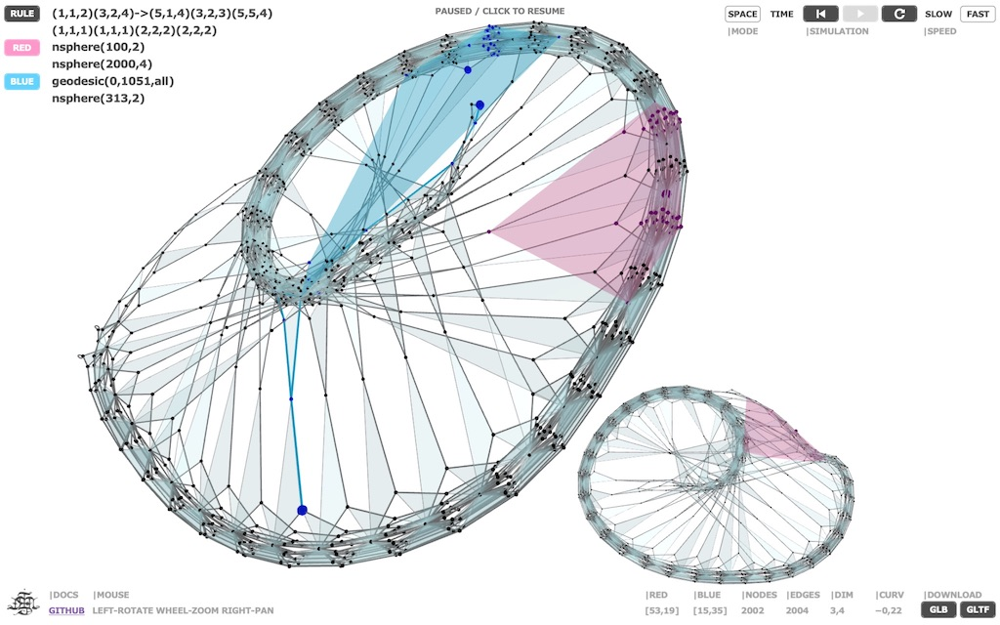

# Hypergraph Rewriting System



**Run it: https://met4citizen.github.io/Hypergraph/**

A hypergraph is a generalization of a regular graph in which an edge (hyperedge)
can join any number of nodes. In a hypergraph rewriting system some initial
state is transformed incrementally by making a series of updating events that follow
some abstract rewriting rule. That is, by following a given rule, subhypergraphs
with particular canonical form are replaced with other subhypergraphs with different
canonical form.

For more information about hypergraph rewriting systems and their potential to
represent fundamental physics visit [The Wolfram Physics Project](https://www.wolframphysics.org)
website. According to their [technical documents](https://www.wolframphysics.org/technical-documents/)
certain models exhibiting the Church-Rosser property (causal invariance) reproduce key
features of both quantum mechanics and special and general relativity.

The web app uses [3d Force-Directed Graph](https://github.com/vasturiano/3d-force-graph)
for representing graph structures, [ThreeJS](https://github.com/mrdoob/three.js/)/WebGL
for 3D rendering and [d3-force-3d](https://github.com/vasturiano/d3-force-3d) for the
force engine.

## Rules

Click `RULE` to modify the rewriting rule and change its settings. Settings include
different options for rule ordering and event orderings and the max number of
rewriting events. Click `RUN` to start the rewriting process.

An example of a hypergraph rewriting rule:

```
(1,1,2)(2,3,4)->(1,5,4)(2,5,3)(5,5,4)
(1,1,1)(1,1,1)
```

In this case, wherever a subhypergraph in the form of the left-hand side pattern `(1,1,2)(2,3,4)`
is found on the hypergraph, it is replaced with a new subhypergraph in the
form of the right-hand side pattern `(1,5,4)(2,5,3)(5,5,4)`. The two sides of the rule must be
separated with an arrow `->`. A rule without the right-hand side is used as the initial
state.

The system supports several rules separated with a semicolon `;` or written
on separate lines. Hyperedge patterns can be described by using numbers and/or
characters. Several types of parentheses are supported. For example, a rule like
`[{x,y}{x,z}]->[{x,y}{x,w}{y,w}{z,w}]` is considered valid and can be
converted to the default format by clicking `Check`.

Some rules to try out (copy-paste the rule part and change the setting if specified):

- (1,2)(1,3)->(1,2)(1,4)(2,4)(3,4)
- (1,2,3)(1,4,5)->(3,3,6)(4,5,6)(6,6,5);(1,1,1)(1,1,1)
- (1,1,2)(3,2,4)->(5,1,4)(3,2,3)(5,5,4);(1,1,1)(1,1,1)
- (1,2,2)(1,3,4)->(3,2,5)(5,5,2)(4,5,5);(1,1,1)(1,1,1) | Set event ordering: DEC
- (1,2,2)(1,3,4)->(1,5,2)(2,3,4)(4,5,5);(1,1,1)(1,1,1) | Set event ordering: DEC

Rule ordering:

Rule order | Description
--- | ---
`NON`<br/>None | Follow event ordering without sorting based on rules. In other words, allow mixing of the rules.
`NDX`<br/>Index order | Regardless of event ordering, always try to apply the event updates in the order in which rules are specified.
`REV`<br/>Reverse index order | Regardless of event ordering, always try to apply the event updates in the *reverse* order in which rules are specified.

Event ordering:

Event order | Description
--- | ---
`RND`<br/>Random order | Shuffle all possible update events (matches).
`ASC`<br/>Ascending time order |  Sort update events so that the least recent match based on the past events is applied first.
`DEC`<br/>Descending time order | Sort update event so that the most recent match based on the the past events is applied first.

## Simulation

Simulation currently supports two modes: `Space` and `Time`.

In `Space` mode the system simulates the evolution of the spatial hypergraph.
According to the Wolfram Model, the spatial hypergraph represents a spacelike
state of the universe with nodes as "atoms of space".

In `Time` mode the system builds up the causal graph. In this view, the nodes are
updating events and the directed edges their causal relationships. According to the
Wolfram Model, the flux of causal edges through spacelike and timelike hypersurfaces
is related to energy and momentum respectively.

Media control buttons let you rewind to the beginning, start/pause simulation and
skip to the end / reheat. `Speed` sets the frame rate.

## Highlighting

When the simulation ends, subgraphs can be highlighted by clicking `RED`/`BLUE`
and using one or more of the following commands:

Command | Description | Examples
--- | --- | ---
`geodesic(n1,n2,[dir],[rev],[all])`<br/><br/>Status line:<br/>Distance as the number of edges. | Shortest path between two nodes.<br/><br/>`dir` = directed edges<br/>`rev` = reverse direction<br/>`all` = all shortest paths | `geodesic(0,10)`<br/>`geodesic(10,200,all)`
`nball(center,radius,[dir],[rev])`<br/><br/>Status line:<br/>N-dimensional volume as the number of edges. | N-dimensional ball is a set of nodes and edges within a distance `radius` of a given node `center`. | `nball(0,4)`
`nsphere(center,radius,[dir],[rev])`<br/><br/>Status line:<br/>N-dimensional area as the number of nodes. | N-dimensional sphere/hypersurface is a set of nodes within a distance `radius` of a given node `center`. | `nsphere(0,4)`
`random(n,distance,[dir],[rev])`<br/><br/>Status line:<br/>Distance as the number of edges. | Random walk starting from a specific node with some maximum `distance`. | `random(1,100,dir)`
`space(n1,n2)`<br/><br/>Status line:<br/>N-dimensional volume as the number of nodes. | Space-like hypersurface based on a range of nodes. `SPACE` mode only. | `space(100,150)`
`time(t1,t2)`<br/><br/>Status line:<br/>N-dimensional volume as the number of nodes. | Time-like hypersurface based on a range of iterations. `TIME` mode only. | `time(300,350)`
`worldline(n)`<br/><br/>Status line:<br/>Distance as the number of nodes. | Time-like curve of the space-like node. `TIME` mode only. | `worldline(0)`
`lightcone(n,length)`<br/><br/>Status line:<br/>Size of the past and future lightlike cones as the number of edges. | Lightcone centered at node `n` with size `length`. `TIME` mode only. | `lightcone(200,4)`

## Notes

During the rewriting process there are often several overlapping matches for the left-hand side part
of the rule. In these cases event ordering setting is used to decide which of the overlapping matches
are replaced and which are ignored. In physical reality, however, all such matches would be replaced
giving rise to quantum mechanics. This means that the simulator shows only one possible classical
evolution of the hypergraph.

Conceptually Wolfram Model comes out of the old Greek tradition of atomism started by Leucippus
(5thC BCE) and his pupil Democritus (ca. 460–370 BCE). In the Hellenistic period the idea was revived
by Epicurus (341–270 BCE) and described by a Roman poet and philosopher Lucretius (ca. 99–55 BCE).
Unfortunately, starting from the Early Middle Ages, atomism was mostly forgotten in the Western
world until Lucretius' *De rerum natura* (On the Nature of Things) and other atomist teachings were
rediscovered in the 14th century. It should be noted that Wolfram's "atoms of space" is much closer
to the ancient Greek idea of *atomos* ("uncuttable") than what chemists would now call atoms.

> “The atoms come together in different order and position, like letters, which, though they
> are few, yet, by being placed together in different ways, produce innumerable words.”
> -- Epicurus (341–270 BCE) (according to one of his later critics Lactantius)
